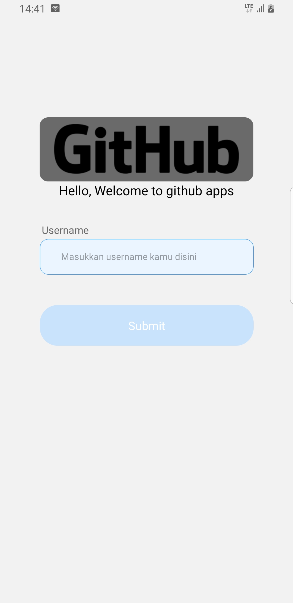
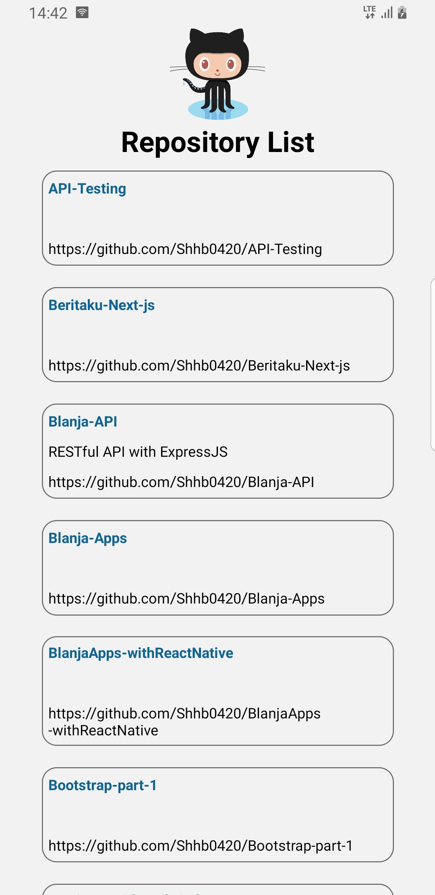

# Github Mobile 

    

## Contents

- [Description](#description)
- [Features](#features)
- [Requirements](#requirements-for-development)
- [Installation](#installation-for-development)
- [Screenshoots](#screenshoots)
- [Apk Github](#apk-github)

## Description

**Github Mobile** sebuah aplikasi dimana user bisa cek list repository yang dimiliki

## Features

- List Repository

## Requirements for Development

- [`Node Js`](https://nodejs.org/en/)
- [`npm`](https://www.npmjs.com/get-npm) or
- [`yarn`](https://classic.yarnpkg.com/en/docs/install/#debian-stable)
- [`React Native`](https://reactnative.dev/)

## Installation for Development

1. Buka terminal / command prompt
2. `git clone https://github.com/Shhb0420/RepositoryGithub`
3. Buat folder di direktori dan ketik `yarn install` untuk menginstall dependencies
4. `yarn start & yarn android` didalam terminal untuk memulai project.

## Screenshoots

<table>
  <tr>
    <td valign="center"></td>
    <td valign="center"></td>
  </tr>
 </table>

## Apk Github

Github mobile versi build, silahkan klik link dibawah ini.

